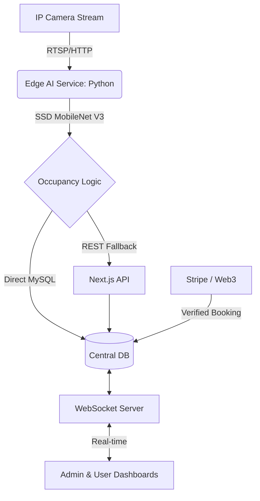

# Slotify: Smart Parking Ecosystem 🅿️

[](IEEE_Research_Analysis.md)
[](https://opensource.org/licenses/MIT)

A state-of-the-art, decentralized Smart Parking solution integrating **Edge AI Computer Vision**, **Predictive Analytics**, and **Web3 Blockchain** technologies.

## 🚀 Vision & Innovation

Slotify transforms traditional parking lots into intelligent, data-driven environments. By deploying localized AI at the edge, we achieve sub-second latency for occupancy detection while maintaining a lightweight cloud presence.

### 🏛️ System Architecture



## ✨ Features

- **Edge AI Vision**: v3.0 SSD MobileNet V3 Large COCO for car detection.
- **Micro-Latency Synchronization**: Direct MySQL writes (< 5ms) + WebSocket broadcasts.
- **Predictive Demand Model**: Random Forest regression to forecast lot availability.
- **Web3 Trust**: Immutable Proof-of-Booking via transaction hashes on the ledger.
- **Smart Fastag Ecosystem**: Automated wallet balance and vehicle tagging.
- **Dynamic Pricing**: (In Progress) Elastic fee adjustment based on real-time demand.

## 🛠️ Tech Stack

| Layer | Technologies |
| :--- | :--- |
| **Frontend** | Next.js 15, React 19, Tailwind CSS, Framer Motion |
| **AI Layer** | Python 3.9, OpenCV DNN, TensorFlow (SSD MobileNet V3) |
| **Data Layer** | MySQL, Prisma ORM, Redis (Optional for caching) |
| **Real-time** | Node.js, Socket.io, Railway Pipelines |
| **Fintech** | Stripe API, Web3 Transaction Hash Integration |

## 📦 Installation & Setup

### 1. Central Application
```bash
npm install
npx prisma generate
npx prisma db push
npm run dev
```

### 2. AI Edge Service
```bash
cd opencv-service
pip install -r requirements.txt
python main.py
```

### 3. WebSocket Telemetry
```bash
cd ws-server
npm install
npm run dev
```

## 📖 Research and Analysis
For a deep dive into the methodology, spatial intersection algorithms, and empirical results, please refer to our **[IEEE Research Analysis](IEEE_Research_Analysis.md)**.

## 🤝 Contributing
Contributions are welcome! Please see our guidelines for more information.

---
*Created with ❤️ for Smart City Urban Mobility.*
